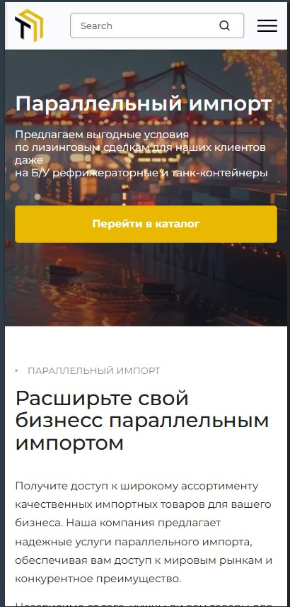

# Brand website of a technology company

Layout of a multi-page website using a ready-made Figma design. Clean HTML, CSS (Flexbox/Grid) і JavaScript for interactive elements - without frameworks.

## Screenshots

| Desktop | Mobile |
|---|---|
|  | 

🔗 **Demo:** https://zhuridochka.github.io/Techno_profi-show/catalog.html#catalog

## What is implemented:
  - 1:1 layout to the layout — indents, fonts, colors
  - Spollers, Tabs, Select
  - BEM-metodology

## Stack:
`HTML5` `CSS3` `JavaScript` · макет — `Figma`
